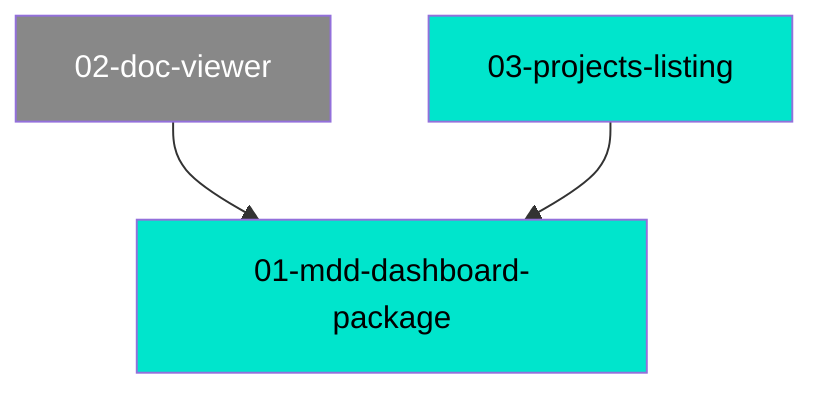

# MDD Connections

## Path Tree

```
Dashboard/
├── Core Package  01-mdd-dashboard-package  complete
├── Doc Viewer  02-doc-viewer  draft
└── Project Picker  03-projects-listing  complete
```

## Dependency Graph



## Source File Overlap

| Source File | Referenced By |
|-------------|--------------|
| src/template.ts | 01-mdd-dashboard-package, 02-doc-viewer |
| src/server.ts | 01-mdd-dashboard-package, 02-doc-viewer |

## Warnings

(none)
