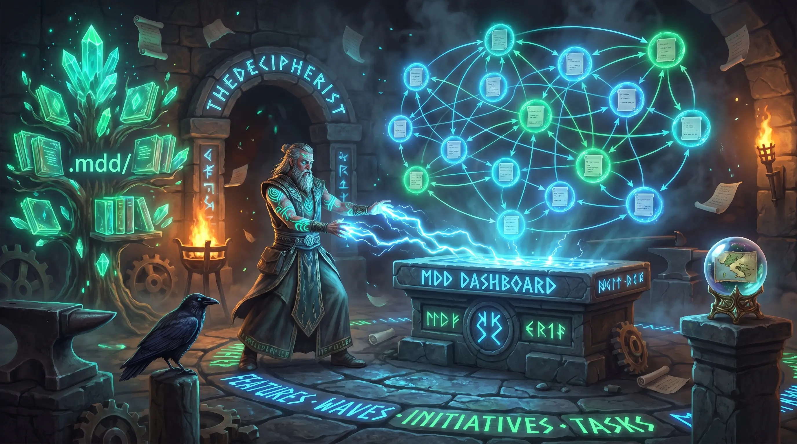

# mdd-dashboard



> Interactive visual browser dashboard for [MDD](https://github.com/) projects - explore your feature graph, track status, and live-reload on file change.


## Install & quick start

```bash
npm install -g mdd-dashboard
```

```bash
cd ~/projects/my-mdd-project
mdd-dashboard
# MDD Dashboard running at http://localhost:7321 - press Ctrl+C to stop
```

Or without installing:

```bash
npx mdd-dashboard --path ~/projects/my-mdd-project
```

## Project picker

When you run `mdd-dashboard` from any direct subdirectory of `~/projects`, the CLI automatically lists all MDD projects found there and lets you pick one with arrow keys:

```
  Select a project  (↑ ↓ to move, Enter to open, Ctrl-C to exit)

  ○  another-project
  ●  mdd-dashboard
  ○  third-project
```

- The cursor defaults to whichever project matches your current directory - just press Enter to open it
- Only directories containing a `.mdd/` folder are shown
- If only one MDD project exists, it opens immediately with no prompt
- Pass `--path` to skip the picker entirely and go straight to a specific project
- Use `--projects-root` to point at a different folder if your projects live somewhere other than `~/projects`

## CLI flags

| Flag | Description | Example |
|------|-------------|---------|
| `--path <dir>` | Project directory to inspect — skips the picker | `--path ~/projects/myapp` |
| `--projects-root <dir>` | Root folder to scan for MDD projects (default: `~/projects`) | `--projects-root ~/work` |
| `--port <n>` | Starting port to try (default: 7321, scans up to 7340) | `--port 8080` |
| `--no-open` | Skip opening a browser tab (useful in CI or remote environments) | `--no-open` |
| `--version` | Print the installed version and exit | |
| `--help` | Print usage and exit | |

## Dashboard features

### Connections view (recommended for large projects)

When your project has a `.mdd/connections.md` file (generated by `/mdd status`), the dashboard opens in **Connections view** automatically:

- **Area path tree** — left sidebar groups every doc by its `area` field (`Website > Auth > Login`, `API > Users > Permissions`, etc.), collapsible by area, with status dots. Click a leaf to scroll its card into view and open the doc panel.
- **Dependency graph** — main canvas renders docs as cards positioned in topological columns (foundations on the right, dependents on the left) with smooth bezier arrows showing `depends_on` relationships.
- **Source overlap** — each card shows a `⚡ N shared` badge when it shares source files with other docs. Hover a card to draw dotted teal edges to all docs that share files with it.
- **Staleness indicator** — amber `⚠ stale` badge appears in the toolbar if `connections.md` is more than one day old.
- **View toggle** — the `View` button in the toolbar switches between Connections and Graph view at any time.

If `connections.md` is absent, a toolbar hint appears and the graph view is used instead.

### Graph view

- **Force / Top-Down / Tree layout** — cycle between a D3 force simulation (organic clustering), a hierarchical top-down layout, and a strict initiative → wave → feature tree
- **Three-tier filter system**
  - *Toolbar*: live search (title + id), type chips (`Features | Tasks | Waves | Initiatives | Ops`), status dropdown - all instant, no server round-trip
  - *Advanced panel*: 11 additional fields including edition, initiative, wave, known issues, last-synced date range, source file path, and route substring
  - *Git filters*: author, modified-since date, changed in last N commits, uncommitted changes - appear automatically after git history loads
- **Directional edge flow animations** - CSS keyframe animations (GPU-accelerated) show dependency direction at a glance; hover or select a node to see incoming vs. outgoing edges distinguished by direction
- **Mini-map** - 160×120px overlay (bottom-right) showing all nodes scaled to fit

### Common to both views

- **Live reload** - file watcher pushes SSE deltas so the graph and connections view update the moment you save a `.md` file; no page refresh needed
- **Detail panel** - click any node or card to open a side panel showing full markdown body, git history (last commit, commit count, `[View history]` expand), source files, and depends-on chips that navigate the graph on click

## Performance - three-tier loading

`mdd-dashboard` is designed to feel instant even on large projects (100+ docs):

| Tier | When | What |
|------|------|------|
| **1 - Frontmatter** | Startup | All `.mdd/**/*.md` files read in parallel; only frontmatter parsed (stops at second `---`). Graph renders in <200ms. |
| **2 - Body** | On demand | Clicking a node fetches and renders the full markdown body via `/api/doc/:id`. Result cached for the session. |
| **3 - Git** | Async background | `git log` and `git status` run after the server starts - they don't block the browser opening. Git filters and the commit history panel appear once this completes. |

## Requirements

- **Node.js >= 20.0.0**
- Any MDD project - any directory containing a `.mdd/` subdirectory with frontmatter-tagged `.md` files

## Error reference

| Message | Cause | Fix |
|---------|-------|-----|
| `Error: no .mdd/ directory found. Is this an MDD project?` | No `.mdd/` in the target directory | Run from an MDD project root, or pass `--path <dir>` |
| `Error: no free port found in range 7321–7340` | All 20 default ports are in use | Pass `--port <n>` to specify a different starting port |
| Node `ParseError` on startup | Malformed YAML frontmatter in a doc | The dashboard still loads; the broken doc appears as a red error node |

## Development

```bash
pnpm install
pnpm dev          # run via tsx - no build step needed
pnpm build        # tsc → dist/
pnpm typecheck    # type-check without emitting
pnpm test         # vitest (102 tests)
```

Architecture overview: `src/cli.ts` → orchestrates startup → `src/parser.ts` (Tier 1) → `src/server.ts` (HTTP routes, including `/api/connections`) → `src/cache.ts` (in-memory Maps) → `src/watcher.ts` (fs.watch debounce) → `src/git.ts` (Tier 3) → `src/connections-parser.ts` (parses `.mdd/connections.md`). See `.mdd/docs/01-mdd-dashboard-package.md` for full architecture and data model.

## License

MIT
